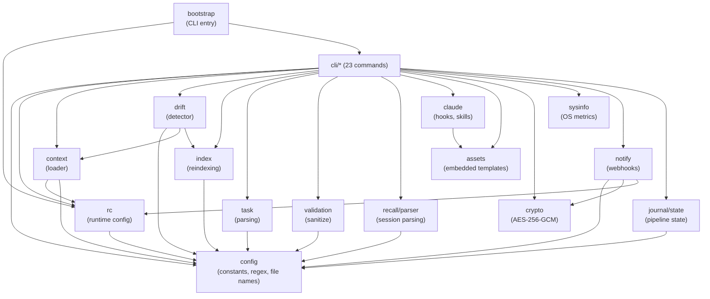

# Package Dependencies (Diagrams)

Parent: [ARCHITECTURE.md](ARCHITECTURE.md)

## ASCII Dependency Tree

```
                          ┌─────────────┐
                          │  cmd/ctx    │
                          │  main.go    │
                          └──────┬──────┘
                                 │
                          ┌──────▼──────┐
                          │  bootstrap  │
                          │  (root cmd) │
                          └──────┬──────┘
                                 │
           ┌─────────────────────┼─────────────────────┐
           │                     │                     │
    ┌──────▼──────┐       ┌──────▼──────┐       ┌──────▼──────┐
    │   cli/add   │       │  cli/agent  │  ...  │ cli/system  │
    │  cli/drift  │       │  cli/recall │       │  cli/watch  │
    └──────┬──────┘       └──────┬──────┘       └──────┬──────┘
           │                     │                     │
    ┌──────┴─────────────────────┴─────────────────────┘
    │  Shared dependencies (selected per command)
    │
    ├──► context ──► rc ──► config          (leaf)
    ├──► drift ──► context, index, rc
    ├──► index ──► config
    ├──► task ──► config
    ├──► validation ──► config
    ├──► recall/parser ──► config
    ├──► claude ──► assets
    ├──► notify ──► crypto, rc, config
    ├──► journal/state ──► config
    ├──► crypto                             (leaf, stdlib only)
    └──► sysinfo                            (leaf, stdlib only)
```

## Dependency Matrix

```
                    config  assets  rc  context  crypto  sysinfo  drift  index  task  validation  recall/parser  claude  notify  journal/state
config                 -
assets                 -      -
rc                     ✓             -
context                ✓             ✓     -
crypto                                           -
sysinfo                                                    -
drift                  ✓             ✓     ✓                        -      ✓
index                  ✓                                                   -
task                   ✓                                                          -
validation             ✓                                                                 -
recall/parser          ✓                                                                            -
claude                        ✓                                                                            -
notify                 ✓             ✓                  ✓                                                          -
journal/state          ✓                                                                                                  -
```

## Mermaid Graph


