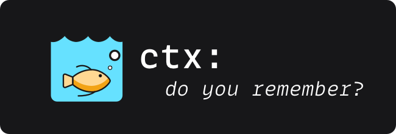
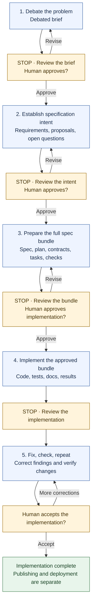

# Beyond the Dumb Zone



## Keeping Decision History While Independently Reviewing AI-Assisted Software Development

*Volkan Özçelik / September 12, 2026*

*How we keep the conversation, review the work, and decide when to move on.*

!!! question "Should You Reset Before Writing Code?"
    An agent and a developer spend hours debating a feature. They
    clarify the problem, reject plausible alternatives, discover that
    an early assumption was wrong, and agree on the intended
    experience. They turn that discussion into a specification intent,
    then a complete specification and implementation plan.

    The session now contains 250,000 tokens in a million-token context
    window.

    Should they reset it before writing code?

A familiar answer is yes: the conversation is approaching the model's
"*dumb zone*".

Start clean, load the specification, and implement with an uncluttered context.

The chart below captures that advice: as the context fills, output
quality falls, eventually crossing from a "*smart zone*" into a "*dumb
zone*". 

If coding sessions followed this curve, resetting before that
boundary would make sense. But does a token count tell us enough to
make that call?


*This drawing illustrates the claim. It is not benchmark data, and
150K is not a proven cutoff.*

But consider **what the reset removes**:

The **history** explains why the obvious design was rejected. It records **which
constraint actually matters, which requirement was deliberately narrowed,
and why a seemingly unnecessary exception exists**. 

The agent has access to the reasoning that produced the specification, 
including details the final document may not fully express.

**A fresh session may have less interference. It may also have less
understanding**.

For a feature that takes hours of discussion, keeping the
agents that took part in that discussion would make sense. 

After all, we wrote down what we agreed, reviewed the work at each stage, 
and corrected mistakes as we found them. 

**A fuller context window, on its own, is not a reason to start over**.

Long conversations can cause problems, though. The research below shows several
ways that happens. 

## What Goes Wrong in a Long Conversation?

People use "*context rot*", "*attention degradation*", and "*smart zone /
dumb zone*" to describe several different problems. The fix depends on which problem you actually have.

| Failure mode        | What it looks like in development                                        | Why the distinction matters                                              |
|---------------------|--------------------------------------------------------------------------|--------------------------------------------------------------------------|
| Retrieval failure   | The agent overlooks a constraint that remains in the conversation.       | The information exists, but is not used reliably.                        |
| Conflicting history | An abandoned proposal competes with its approved replacement.            | The agent needs to know which decision replaced which.                   |
| Anchoring           | The agent keeps repairing a design built on a disproven assumption.      | More repetition of the same reasoning may preserve the mistake.          |
| Handoff loss        | A replacement agent follows the spec but misses why a decision was made. | Resetting can introduce a new failure.                                   |
| Version confusion   | A reviewer evaluates code against an obsolete contract.                  | Correct recall of old information is still the wrong basis for judgment. |
| Evidence failure    | Everyone accepts an implementation claim without inspecting behavior.    | A shorter context does not supply missing verification.                  |

These are things we can observe. A missed requirement does not tell us
what happened inside the model.

Three concepts also need separation. The **model** processes the input
it receives. The **harness** assembles that input, manages tools, and
may summarize or remove material. The **agent** is the resulting system
carrying out the task. Improved behavior can come from any combination
of those layers.

That is why **a session's visible length is a weak standalone measure of
its quality**. We also need to know what the input contains, how
current instructions are distinguished from history, what evidence is
available, and what the agent must do next.

## What the Research Says

### Position and Task Structure Matter

Liu and colleagues' *Lost in the Middle* studied multi-document question
answering and key-value retrieval. Performance often depended on where
relevant information appeared, with stronger results near the beginning
or end than in the middle. Having the information in context did not mean the model would use it.
[Liu et al., 2023](https://arxiv.org/abs/2307.03172)

RULER broadened evaluation beyond finding a single hidden item. Its
tasks include multiple needles, multi-hop tracing, and aggregation.
Models that performed well on a simple retrieval test could still
degrade on more demanding long-context tasks. A model's advertised window size and a successful retrieval test tell
us little about how it will handle those harder tasks.
[Hsieh et al., 2024](https://arxiv.org/abs/2404.06654)

Chroma's *Context Rot* report evaluated 18 models using controlled
tasks, including retrieval variations, conversational memory
evaluation, and repeated-word reproduction. It found nonuniform
performance as input length increased and examined the effects of
distractors, semantic similarity, and input structure. Longer input caused problems even on simple tasks. The report did not
compare the development workflows discussed here.
[Hong, Troynikov, and Huber, 2025](https://www.trychroma.com/research/context-rot)

Even useful history can be misread. An old proposal may still look
relevant after the team has rejected it.

### Early Mistakes Can Stick

Laban and colleagues compared single-turn and multi-turn settings across
six generation tasks, analyzing more than 200,000 simulated
conversations. They reported an average performance drop of 39% in the
multi-turn setting and identified reliance on early assumptions and
premature solutions as an important failure pattern. That number
describes their experimental setup; it is not a prediction that a long
coding session loses 39% of its quality.
[Laban et al., 2025](https://arxiv.org/abs/2505.06120)

That is a failure I want our reviews to catch: the agent continuing to
build on an assumption we already corrected. The study does not tell us
how well our checkpoints prevent it.

### Long-Context Capability Has Improved

Historical findings should not be converted into permanent numerical
ceilings. In its February 2026 Opus 4.6 announcement, Anthropic
reported 76% on the eight-needle, million-token MRCR v2 evaluation,
compared with 18.5% for Sonnet 4.5. Those are Anthropic's retrieval benchmark results, not a test of a
long-running coding session.
[Anthropic, 2026](https://www.anthropic.com/news/claude-opus-4-6)

A design discussion, a repository dump, and thousands of lines of repetitive 
logs are very different inputs.

Using only 25% of a million-token window does not necessarily certify reliability.

**Capacity and useful performance are different measurements**.

Anthropic's context-engineering guidance itself describes degradation
as a gradient rather than a hard cliff and recommends selecting
sufficient, high-signal information. That guidance is compatible with
preserving substantial useful history; "minimal" need not mean short.
[Anthropic, 2025](https://www.anthropic.com/engineering/effective-context-engineering-for-ai-agents)

### Reviewers Can Help (*...and confidently be wrong*)

Du and colleagues found benefits from multiagent debate on the
factuality and reasoning tasks they studied. That is a reason to try multiple 
reviewers. It does not tell us that three is the right number for software development.
[Du et al., 2023](https://arxiv.org/abs/2305.14325)

Research on LLM judges also identifies position, verbosity, and
self-enhancement biases. Its preference-evaluation setting differs from
code review, but it gives a concrete reason to avoid treating a model's
favorable judgment as an objective measurement of correctness.
[Zheng et al., 2023](https://arxiv.org/abs/2306.05685)

Finally, research on intrinsic self-correction found that models could
struggle to improve reasoning without external feedback, sometimes
making it worse. The study examined self-correction without external feedback. Asking
an agent to "think again" gives it less to work with than a failing test
or a specific counterexample.
[Huang et al., 2024](https://arxiv.org/abs/2310.01798)

These findings inform the process below: keep useful history, make
changed decisions clear, and check the output.

## Resetting Context Can Lower Quality, Too

A specification is a deliberate selection of information. It states
what should be built and the constraints governing that work. The
preceding conversation often contains more: counterexamples, rejected
approaches, conditional reasoning, and the circumstances under which a
decision should be reconsidered.

Consider a fictional command-line tool that installs reusable
workflows.

The first proposal says installations should update automatically.
During debate, the developer explains that a selected version must
remain reproducible. The team rejects automatic updates, decides that
checking for updates is allowed, and requires explicit selection before
the installed version changes.

The final specification says:

> Installation versions are pinned. Updates require explicit user
> action.

That is a useful requirement. But the history also clarifies why an
"update available" notice is acceptable while changing the executable
payload is not. It may explain what happens when a registry is
unreachable and whether a failed update can disturb the current
installation.

A persistent implementer can use that rationale when encountering an
unanticipated edge case. A fresh implementer may have to rediscover it,
ask the developer again, or choose an interpretation that is locally
plausible but inconsistent with the original intent.

This does not justify keeping binding requirements only in
conversation. If an edge case affects acceptance, it belongs in the
approved artifacts. The point is that documents can be incomplete, and
implementation frequently reveals questions that were not obvious
during drafting.

Keep the approved spec and the reasoning behind it available together.

!!! warning "Continuity Is Not Authority"
    There is a corresponding danger: If the persistent agent silently
    implements a remembered promise that never reached the approved
    spec, the code can diverge from the review baseline. 

    **Continuity helps identify the gap; it does not authorize bypassing it**. 
    The gap should become a proposed amendment, approved before it changes
    scope.

Think of a specification as the agreed design and the conversation as
the design notebook. The notebook can explain the design. It can also
contain crossed-out designs. Keeping the notebook is useful only if the
team knows which drawing it has approved.

## Continuity Matters More than Context Window Size

Keep the implementation and review sessions while their history helps.
The implementer should not have to forget the design discussion just
because it is time to write code.

The approved spec still governs the work. If an earlier conversation
contradicts it, the agent should point out the conflict. It should not
quietly choose whichever version it remembers best.

The agent that writes the work also does not decide when we move to the
next stage. It finishes, we review, and the human approves the next step.

At each transition, a short note identifies the approved version, changed
decisions, open questions, and what the agent may do next. That saves us
from having to reconstruct the current state from the conversation.

## A Practical Run, Still in Progress

This workflow is also how we are developing a real feature. 

At the time of writing, we have taken it through a debated brief, 
specification intent, and a full specification bundle, with repeated reviews 
and revisions at each checkpoint. 

So far, **we have not deliberately reset any of the participating agent
conversations**. 

I have kept the two external frontier-model review
sessions **across the brief, intent, and bundle reviews**. 

The steering reviewer has kept its conversation too, even while we worked 
on side questions and this article. 

The agent responsible for authoring the artifacts and eventually implementing 
the feature has also remained in the same session.

Our intention is to keep those sessions through implementation and the
subsequent code-review loop as well. 

We do not need the implementer to get everything right on its first
attempt: I need it to understand the design, respond to useful feedback,
and make changes we can check. **We can correct its work without first
throwing away the discussion that led to it**.

We may still need a fresh session if repeated corrections stop helping.
However, based on former similar implementations, that case will be an
exception rather than the norm.

## This Is Not Our First Rodeo

This is not the first time we are following this workflow and so far
we haven't gotten into a situation where the Oracle model proposes
changes and the implementer agent wasn't able to implement them sufficiently,
hence diverging from a desired quality and product behavior.

In short, every single feature we have implemented using the proposed methodology
in this article **successfully converged** into a **desired outcome**.

So far, we haven't needed to `/clear` any session anywhere.

Moreover, neither changing stages nor discussing side topics has given us
a reason to start over.

So based on our anecdotal experience, in this particular workflow, 
we can assume that needing to `/clear` **any** session is an *exception* rather 
than the norm.

## Who Does What

We use one **implementation agent**, three **reviewers**, and a **human
who makes the product decisions**. We keep their conversations across
stages and save the agreed decisions in files.

| Role                                  | Responsibility                                                                    | Boundary                                            |
|---------------------------------------|-----------------------------------------------------------------------------------|-----------------------------------------------------|
| Human product owner                   | Make product decisions, transfer the files, and approve each stage.               | Decide whether remaining issues are acceptable.     |
| Implementation agent (Frontier Model) | Write the brief, spec, and code; run checks; respond to reviews.                  | Stop at each checkpoint. Ask before changing scope. |
| External reviewer A (Frontier Model)  | Review the current files using the project history and available evidence.        | Say what it checked and what it could not check.    |
| External reviewer B (Frontier Model)  | Review the same files and explain its findings.                                   | Reach its own conclusions before reading A’s.       |
| Steering reviewer (Frontier Model)    | Check the revised work against the user’s decisions and send further corrections. | Be willing to withdraw its own earlier advice.      |

We sometimes call the steering reviewer an "oracle." It can be wrong
too. Its findings need the same scrutiny as anyone else’s.

Different models can catch different mistakes. They can also share
blind spots, especially after several rounds of working on the same
design. Each still needs to explain and support its findings.

## The Five Stages and Their Hard Stops

The workflow can use any suitable specification tools. In this public
adaptation, [`/ctx-plan`][scrutinize-recipe] produces a debated brief,
[`/ctx-spec`][design-recipe] produces a specification intent, and a
specification engine such as [GitHub Spec Kit](https://github.com/github/spec-kit)
produces the full bundle. The review loop described here is something we add around
those tools.



### Stage 1: Debate the Problem

The developer and implementation agent examine the problem before
committing to a design. The resulting brief explains the intended
experience, constraints, alternatives, failure modes, validation
approach, and open decisions.

Reviewers should ask whether the problem is correctly framed, whether
proposed complexity follows from actual needs, and whether an
attractive option was dismissed without sufficient evidence. They
should identify hidden assumptions and ask what would disprove them.

The agent stops before creating the specification intent. A finished
brief is not permission to proceed. The human approves advancement
after findings have been addressed or explicitly accepted.

### Stage 2: Establish the Specification Intent

The agent converts the approved debate into a document that separates
settled requirements from proposals, assumptions, and unresolved
choices.

Check what survived the rewrite. Did a conditional
preference become a mandatory requirement? Did a rejected approach
return through different wording? Did an important exclusion
disappear? Is it clear who needs to answer each remaining question?

The intent should be structured enough to guide a specification engine
without pretending that open decisions are settled. The agent stops
before that handoff.

### Stage 3: Review the Full Specification Bundle

The next artifact includes the specification, design or plan,
contracts, tasks, and consistency analysis appropriate to the project.

Review the complete bundle together. An individually reasonable task
list can contradict a contract. A design can satisfy the feature
description while violating an operational constraint. A test plan can
verify examples without covering the required failure behavior.

For each important requirement, reviewers should find the design that
implements it and the check that would show it works. The human approves 
the bundle version before implementation begins.

This stage is particularly important because three reviewers examining
code against an incomplete specification can all miss the same lost
requirement. Reviewing the transformation from intent to bundle helps
expose that loss earlier.

### Stage 4: Implement the Approved Bundle

The implementation agent continues in its established session. It
writes code, tests, documentation, and validation evidence against the
approved baseline.

When implementation exposes an ambiguity, the agent records it. A local
implementation choice within the approved design can be resolved
normally. A change to product behavior, a binding constraint, or an
approved contract returns for explicit decision.

The agent stops with a complete implementation package. Review checks
both specification compliance and the intended developer experience.
Reviewers inspect actual source and behavior where their tools permit;
an author's summary is only a starting point.

For work with an expensive architectural uncertainty, insert an
optional review after the first meaningful implementation slice. 
Review it before building the rest.

### Stage 5: Fix, Check, Repeat

The agent evaluates findings, makes justified corrections, updates
evidence, and stops again. Reviewers verify those corrections and
inspect affected behavior for regressions.

Completion requires explicit human acceptance. Unresolved findings
remain visible, including their impact and the reason they are accepted
or deferred. Copying work to another environment, opening a pull
request, publishing, or deploying remain separate actions governed by
the permissions of the project. Acceptance of an implementation does
not implicitly authorize every downstream action.

## The Review Loop

At each checkpoint, use the following sequence.

1. **Freeze the candidate.** The implementation agent identifies the
   artifact version or commit, supplies the supporting evidence, and
   stops.
2. **Obtain two separate critiques.** The human submits that candidate
   to external reviewers A and B. Each records its findings before
   seeing the other's current conclusions.
3. **Evaluate the feedback.** The implementation agent assesses each
   finding, revises where justified, and records what it accepted or 
   rejected and why. Feedback is not automatically a requirement.
4. **Synchronize the revision.** The human transfers the exact revised
   artifact and relevant evidence into the steering reviewer's
   workspace.
5. **Review the revised candidate.** The steering reviewer inspects it
   against requirements, prior decisions, source, and evidence. Where
   practical, provide a clean copy of the revised artifact, with the earlier 
   reviews kept separately. It writes its own findings
   first, then compares them with the earlier reviews.
6. **Correct and verify.** The agent addresses findings and stops.
   Material revisions may return to the external reviewers. Repeat
   until the completion criteria are met.
7. **Approve the next stage.** The human explicitly authorizes
   advancement. A favorable review never opens the gate automatically.

The third reviewer sees a revised version, so this is not three models
independently reviewing identical work. If the earlier verdicts are
inside the document, it sees those too. Keeping review notes separate
helps it form its own judgment, although the revisions already reflect
the earlier feedback.

For an experiment that measures reviewer agreement, give all three
reviewers the same frozen artifact before any revisions. 

For day-to-day engineering, sequential review can be preferable because 
the later reviewer checks what actually changed. Neither arrangement requires
erasing prior project context.

## Independence Without Amnesia

**A reviewer does not have to forget the project to review it independently**.

A reviewer can **remember** the entire product discussion and still derive
its current findings without copying another reviewer's conclusions.
Conversely, a fresh reviewer can be strongly anchored by an
implementation summary that explains why the code is supposedly
correct.

The useful separation is between **shared facts** and **shared
verdicts**:

Reviewers should receive the same **authoritative requirements, 
current decisions, and candidate version**. They should
first reach their own conclusions about the current candidate. 

After that, sharing findings is **desirable**: 
it allows errors to be challenged and omissions to be discovered.

**Persistent reviewers can contribute a form of continuity that fresh
reviewers lack**: They can recognize that a newly proposed
"simplification" reintroduces a previously rejected failure mode. They
can also become attached to recommendations they helped create.

Make that vulnerability explicit in their instructions: earlier advice
is revisable. When a defect is found, classify whether it belongs to
the implementation, the specification, a prior assumption, or the
review itself. Do not force every problem into "the implementer failed
to follow the plan." Sometimes the plan is wrong.

!!! tip "Evidence Outweighs Votes"
    Avoid majority voting as the primary resolution method. One
    reviewer with a reproducible counterexample can outweigh two
    reviewers who found no issue. 

    Three reviewers repeating the same
    unsupported concern do not turn it into evidence.

* Reviewers help find problems. 
* Evidence settles technical claims; 
* **the human settles product choices**.

## What to Hand the Reviewer

Long conversations become easier to use when the current state is
explicit. A lightweight checkpoint package should include:

* The stage, candidate identifier, and approved baseline it derives
  from.
* The artifacts under review, including exact code revision where
  applicable.
* Current decisions, superseded assumptions, and unresolved questions.
* A change summary relative to the previous reviewed version.
* Validation commands, relevant environment information, outcomes, and
  known gaps.
* Earlier findings, what was done about them, and why.
* The action currently authorized and the action that still requires
  approval.

### Keep the Package Proportional to the Work

A small change can use a single Markdown file plus a commit. A large
specification bundle may need an index. There is no benefit in generating
elaborate tracking material that nobody reads.

The conversation explains how we got here. This package tells everyone
which version to work from.

### Example Checkpoint Record

```yaml
stage: implementation-review
candidate: <exact-commit-sha>
approved_spec: <spec-bundle-version>
decision_record: <decision-record-version>
authorized_action: address findings within approved scope
next_gate: human acceptance of implementation
validation:
  - command: <exact-command>
    environment: <relevant-runtime-and-platform>
    result: <pass-fail-or-blocked>
known_gaps:
  - <behavior-not-yet-verified>
```

Adapt these fields to your tools and fill them with actual results. A command 
that the agent suggests running is different from a command it ran, and both 
are different from a command a reviewer reproduced independently.

### Example Finding Record

```text
ID: R-017
Candidate: <exact-commit-sha>
Category: defect
Impact: failed update can remove the working installation
Requirement: REQ-12; approved decision D-04
Evidence: <code location and failing reproduction>
Expected: prior installation remains usable after update failure
Observed: prior installation is removed before replacement succeeds
Requested action: preserve the prior installation through failure
Disposition: accepted
Correction: <correcting-commit-sha>
Verification: <reproduction now passes; affected checks and results>
Status: verified
```

A useful finding explains an observable problem. It does not need to
prescribe the entire implementation. Allow the author to choose a sound
correction within the approved constraints.

Mark findings as accepted, rejected with evidence, duplicate, deferred
with approval, or awaiting a product decision. "Fixed" should
identify a correction. "Verified" should identify the evidence that the
correction works.

## Review the Behavior, Not Just the Documents

The fictional pinned-version installer illustrates the difference
between compliance language and observable behavior.

The implementation may contain a confirmation prompt and therefore
appear to satisfy "updates require explicit action." But perhaps
invoking a read-only listing command refreshes a cache that replaces
the installed payload. The prompt exists, tests pass, and the intended
guarantee is still broken.

A reviewer should inspect the paths that can change the installation,
then exercise the relevant scenario. It should ask whether an update
failure preserves the previous working state, whether an offline
operation behaves as intended, and whether a normal user can tell which
version will execute.

The exact tests depend on the feature. The general review questions are
reusable:

1. Does the behavior satisfy the approved requirement?
2. Does it preserve the constraint that motivated that requirement?
3. Does it behave correctly on the failure paths that matter?
4. Can the intended user complete the task without hidden assumptions?
5. Is the available evidence sufficient to answer those questions?

Tests authored alongside an implementation may reproduce the same
interpretation error. Reviewers should derive at least the
important checks from requirements and failure scenarios rather
than merely read test names. Where appropriate, they can add a
counterexample, exercise an integration boundary, or inspect an
invariant directly.

A reviewer without execution access should say that its review is
static. A reviewer that receives only a diff should state what
repository context is missing. Say what you checked and what you 
could not check.

## When Reviews Stop Helping

Another review is useful if it finds a problem or checks a correction.
It is less useful if it keeps reopening settled questions without new
evidence. Agree on when to stop.

**Classify** comments before acting on them. A defect violates an approved
expectation or exposes an actual failure. A scope question requires a
product decision. An optional improvement may be worthwhile later. A
style preference is not automatically a blocker.

Finish a stage when blocking findings are resolved or explicitly
accepted, the relevant acceptance criteria have supporting evidence,
corrections have been checked for affected regressions, and the human
approves the candidate. Reviewers may retain documented reservations;
everyone does not have to like every choice.

**Review the affected decisions** again when a fix changes them. 
If a correction alters a public contract, it may require renewed 
specification review. If it only repairs an implementation branch 
to meet the existing contract, targeted verification may suffice. 

**Judge the affected behavior and assumptions rather than mechanically 
rerunning every review**.

**Record important rejected findings**, too. Otherwise a later reviewer may
reopen the same concern without recognizing the evidence that settled
it. Preserve the possibility of reconsideration when new evidence
appears.

**If review rounds produce contradictory requests, repeatedly change the
same decision, or stop yielding meaningful evidence, pause the loop**.
Identify the disputed assumption and ask what observation or product
decision would resolve it. Another general request to "review again"
may only generate more prose.

## When to Keep, Restructure, or `/clear` the Context

Keep the session while it works. When it stops working, identify what
went wrong before deciding whether a reset would help.

| Observed situation                                                                    | First response                                                       | When a reset or handoff becomes reasonable                                          |
|---------------------------------------------------------------------------------------|----------------------------------------------------------------------|-------------------------------------------------------------------------------------|
| The agent uses current decisions correctly and produces verifiable progress.          | Continue. Keep current artifacts identifiable.                       | No reset is justified solely by occupancy.                                          |
| An obsolete proposal reappears.                                                       | Show the decision that replaced it.                                  | The agent repeatedly returns to the obsolete premise despite correction.            |
| The session contains large amounts of reproducible logs or obsolete source snapshots. | Use targeted retrieval and available pruning or compaction controls. | The harness cannot maintain a usable input and a prepared handoff is more reliable. |
| Reviewers disagree because they examined different versions.                          | Synchronize the exact candidate.                                     | Resetting is unnecessary unless other problems remain.                              |
| Implementation repeatedly fails the same clear invariant.                             | Inspect the failed assumption and require a concrete reproduction.   | A fresh implementer or focused diagnostic session can test another interpretation.  |
| The project moves to an unrelated task.                                               | Prepare the relevant state for that task.                            | Historical detail adds little useful information.                                   |
| Context limits or compaction threaten necessary history.                              | Preserve decisions, evidence, and retrieval pointers explicitly.     | Continue from a verified handoff if needed.                                         |

An uninterrupted conversation does not guarantee that every original
token reaches the model. Harnesses can manage long conversations
through compaction; [Anthropic documents this explicitly][ctx-window]. 

Thus,record relevant compaction events when evaluating the process, and keep
important decisions in files even when no manual reset occurs.

[ctx-window]: https://platform.claude.com/docs/en/build-with-claude/context-windows "Claude Context Window"

A handoff should include the approved spec, reasons for key decisions,
abandoned assumptions, current code version, completed checks, open
findings, and the next task. A fresh session with that information may
work very well.

An optional fresh reviewer can also be useful for a narrow question:

* "**Does this contract make sense on its own?**" 
* or "**Can a developer follow this installation guide without the debate?**" 

That checks whether the document works for someone who was not in the
design discussion.

## What Does It Cost to Finish?

Three persistent reviewers, repeated revisions, and human coordination
consume **time and money**. 

The relevant question is whether they prevent enough defects, 
misunderstanding, and rework to justify that cost for the task.

Count the whole job:

```text
Total cost = implementation
           + review
           + correction
           + human coordination
           + later rework
```

Later rework is hard to estimate. Count what you can observe; do not
claim savings for bugs that might never have happened.

Track model charges across all participants, tool and infrastructure
costs when significant, elapsed time, and active human minutes. Track
accepted results and failures, not only tokens per successful response.
A workflow that creates cheaper drafts but requires repeated
reconstruction of intent may cost more to finish. A workflow that
spends heavily on reviews of a trivial change may simply be wasteful.

**Caching can reduce the bill**. 
However, it does not tell you whether the answer is right.

Likewise, **a shorter context can lower input cost without improving the
final result**. Read actual usage records and pricing for the environment
in use rather than infer cost from the visible conversation length.

I would spend this much review effort on ambiguous requirements or a
design that would be expensive to get wrong. A small, easily tested fix
probably needs less. 

That said, based on our work so far, **three reviewers** happens to provide 
the "*sweet spot*" for classes of work that a skilled senior engineer can spend 
*about a week* to implement end-to-end.

## How Do We Test Whether the Approach Is Better

To find out whether keeping context actually helps, we need to separate
its effect from the quality of the handoff and the amount of review.

Start from the same repository state and approved specification
checkpoint. Compare at least these implementation conditions:

| Condition                       | Implementer input                                                                             | What it helps measure                                      |
|---------------------------------|-----------------------------------------------------------------------------------------------|------------------------------------------------------------|
| Persistent session              | Existing debate, decisions, artifacts, and current implementation instructions.               | Value and cost of accumulated history.                     |
| Fresh session with full handoff | Spec, decision rationale, exclusions, superseded assumptions, and relevant repository access. | Whether curated state can preserve the useful information. |
| Fresh session with spec only    | Approved specification and normal repository access.                                          | Practical loss when relying on the spec alone.             |

Hold the downstream review procedure constant for the primary
comparison. Otherwise, a persistent implementer with three reviewers
versus a fresh implementer without review measures several changes at
once.

Use multiple tasks and repeated runs where affordable. Include both
decisions that depend on historical rationale and tasks whose
specification is self-sufficient. 

Fix model versions and record harness configuration, reasoning settings, 
tool permissions, context construction, and compaction behavior. 
When those cannot be fixed, report the variation.

Predefine acceptance criteria and evaluation checks before examining
the results. Where practical, have a final evaluator inspect anonymized
artifacts without knowing which condition produced them. Keep those
evaluation checks separate from the implementer's own tests. Account
for human learning across runs: a coordinator who sees the first
solution may unintentionally steer the second more effectively.

Useful outcome measures include acceptance rate within budget,
serious defects left at evaluation, requirements omitted or
misinterpreted, accepted review findings, false-positive review burden,
revision rounds, human effort, total cost, and elapsed time. Include
unsuccessful runs; reporting only the cost of successful tasks hides an
important part of the tradeoff.

A second experiment can compare persistent and fresh reviewers while
holding implementation artifacts constant. A third can compare one
versus three reviewers. These isolate whether gains come from retained
context, review diversity, extra inference effort, or the human's
coordination.

So far, based on our active production work in `ctx` we have found that:

* **history helps with unresolved design questions**,
* while a good handoff works just as well when the spec is a "*bounded task*"
  that is *well-defined* and there is not much room for ambiguity
  (*for, i.e., add a new flag to the CLI*).

This is important in telling us **when keeping the session is worth it**.

## Instructions You Can Reuse

The following instructions condense the procedure into something a
team can adopt. The baseline and candidate placeholders must be filled
at each checkpoint.

### For the Implementation Agent

```text
Own the planning artifacts, specification, implementation, and validation.
Retain the useful project history across stages.

Current stage: <stage>
Approved baseline: <artifact version or commit>
Candidate under review: <artifact version or commit>
Authorized action: <specific activity>
Next approval gate: <gate>

Use the approved baseline and approved amendments as the current contract.
Use earlier discussion as rationale. Surface conflicts or missing binding
requirements; do not silently resolve them by changing product scope.

At each checkpoint, produce the artifact and supporting evidence, then stop.
Evaluate feedback rather than accepting it automatically. Record each
significant finding’s outcome and the evidence supporting that decision.

After corrections, identify the new candidate and update validation evidence.
Do not treat artifact completion or favorable review as approval to advance.
```

### For Each Reviewer

```text
Review the exact candidate against the approved requirements, current
decisions, intended user experience, and available source and evidence.
Retain useful history, including reasons for rejected alternatives.

Form your initial current-round findings before reading other reviewers'
current conclusions where the review sequence permits. Then compare findings.

Report concrete defects, scope questions, and optional improvements
separately. For a defect, identify impact, evidence, the violated expectation,
and a reproduction or verification method where possible.

Reconsider your own earlier recommendations when evidence contradicts them.
Distinguish implementation defects from specification defects and invalid
assumptions. Do not invent new scope as a review fix.

State review coverage and limitations. Do not claim checks you did not run.
Verify corrections against the revised candidate and inspect affected
behavior for regressions. Leave unresolved findings explicit.
```

### For the Human Coordinator

Maintain one identifiable current candidate per checkpoint. Transfer
exact versions, preserve the review record, decide product questions,
and approve stage transitions explicitly. Require evidence for
important claims, including claims made by reviewers. When a
concern remains unresolved, accept it consciously or keep the gate
closed.

## Before You `/clear`

Before clearing a coding session, ask what you are trying to fix. If the
agent is following current decisions and its work holds up under review,
I would keep going. If it repeatedly returns to a rejected design or
cannot apply a clear correction, I would consider a fresh session with a
careful handoff.

The token count alone does not answer that question. The conversation
may contain mistakes and abandoned ideas. It may also contain the reason
you rejected the design a fresh agent is about to propose again.

For our current feature, we are keeping that history and checking the
work at each stage. The implementation review is still ahead of us. We
will judge the process by the code we accept, the bugs we find, and what
it costs to get there.

## Into the Rabbit Hole 🐇

A few earlier field notes cover related parts of this process.

* [The Attention Budget][attention-post] explained why more context is
  not automatically better. This post is the other half of that
  argument: less context is not automatically safer, and the token
  count alone does not tell you which situation you are in.
* [The Cheapest Patch Was the Most Expensive][cheapest-post] measured
  accepted-patch cost across seven runs. [What Does It Cost to Finish?](#what-does-it-cost-to-finish)
  applies that same accounting to the reset decision.
* [Context as Infrastructure][infra-post] made the case that decision
  history should be durable rather than conversational. The checkpoint notes here keep those decisions in files that
  anyone on the project can read.
* [Code Is Cheap. Judgment Is Not.][judgment-post] separated production
  from judgment. [The Review Loop, Step by Step](#the-review-loop-step-by-step)
  is a structure for that judgment: the reviewers search for defects,
  but the human still decides when to proceed.

In tool form, `ctx` ships the first two stages: [Scrutinizing a
Plan][scrutinize-recipe] is the debated brief, and [Design Before
Coding][design-recipe] walks the brief through spec and implementation.
The review protocol above is what wraps around them.

## References and Further Reading

The sources below support specific parts of the argument. None
evaluates the complete workflow in this article. Publication years
refer to the cited research or release; product documentation is a
living source consulted for this article on September 12, 2026.

1. **Nelson F. Liu et al. (2023). [Lost in the Middle: How Language
   Models Use Long Contexts](https://arxiv.org/abs/2307.03172).**
   Research on the effect of relevant-information placement in
   long-context question answering and retrieval. Useful for
   understanding why presence in context does not guarantee reliable
   use.

2. **Cheng-Ping Hsieh et al. (2024). [RULER: What's the Real Context
   Size of Your Long-Context Language
   Models?](https://arxiv.org/abs/2404.06654).** COLM 2024. A broader
   synthetic evaluation covering retrieval variations, tracing, and
   aggregation. Useful for distinguishing nominal window size from
   performance on demanding tasks.

3. **Kelly Hong, Anton Troynikov, and Jeff Huber (2025). [Context Rot:
   How Increasing Input Tokens Impacts LLM
   Performance](https://www.trychroma.com/research/context-rot).**
   Chroma technical report, July 14, 2025. Controlled experiments on
   input length and context composition. The authors provide
   [replication code and experiment
   materials](https://github.com/chroma-core/context-rot).

4. **Philippe Laban et al. (2025). [LLMs Get Lost In Multi-Turn
   Conversation](https://arxiv.org/abs/2505.06120).** A simulated
   comparison of single-turn and multi-turn task specification.
   Relevant to premature assumptions and difficulty recovering from
   earlier solutions; not a direct coding-session threshold study.

5. **Anthropic (2026). [Introducing Claude Opus
   4.6](https://www.anthropic.com/news/claude-opus-4-6).** February 5,
    2026. Primary vendor source for the cited MRCR v2 comparison. Read
          its benchmark claims as model- and evaluation-specific evidence.

6. **Anthropic (2025). [Effective Context Engineering for AI
   Agents](https://www.anthropic.com/engineering/effective-context-engineering-for-ai-agents).**
   September 29, 2025. Engineering guidance on context selection,
   retrieval, compaction, and structured memory. Guidance rather than a
   controlled test of this article's process.

7. **Yilun Du et al. (2023). [Improving Factuality and Reasoning in
   Language Models through Multiagent
   Debate](https://arxiv.org/abs/2305.14325).** Research supporting
   investigation of multiple model perspectives, with different tasks
   and procedures from the workflow described here.

8. **Lianmin Zheng et al. (2023). [Judging LLM-as-a-Judge with MT-Bench
   and Chatbot Arena](https://arxiv.org/abs/2306.05685).** NeurIPS 2023
   Datasets and Benchmarks. Discusses model judges and biases relevant
   to interpreting automated judgments. Human-preference agreement
   should not be equated with software correctness.

9. **Jie Huang et al. (2024). [Large Language Models Cannot
   Self-Correct Reasoning Yet](https://arxiv.org/abs/2310.01798).**
   ICLR 2024; initially posted in 2023. Examines intrinsic
   self-correction without external feedback. Useful for distinguishing
   unsupported reconsideration from correction informed by additional
   evidence.

10. **Anthropic. [Context
    Windows](https://platform.claude.com/docs/en/build-with-claude/context-windows).**
    Living platform documentation. Relevant to the difference between a
    continuing conversation and the actual context supplied to a model,
    including compaction.

11. **GitHub. [Spec Kit](https://github.com/github/spec-kit).** Official
    repository and documentation for a specification-driven development
    toolkit. A possible tool for producing and implementing
    specification artifacts; the persistent multi-reviewer protocol in
    this article is an additional process.

---

*This post is part of the [`ctx` field notes][blog] series,
documenting what we learn building persistent context infrastructure
for AI coding sessions. This post describes a process we are using and how we would test it.*

[attention-post]: 2026-02-03-the-attention-budget.md
[cheapest-post]: 2026-06-21-the-cheapest-patch-was-the-most-expensive.md
[infra-post]: 2026-02-17-context-as-infrastructure.md
[judgment-post]: 2026-02-17-code-is-cheap-judgment-is-not.md
[scrutinize-recipe]: ../recipes/scrutinizing-a-plan.md
[design-recipe]: ../recipes/design-before-coding.md
[blog]: index.md
